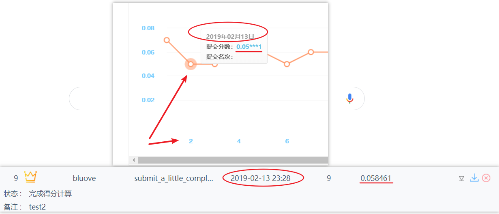
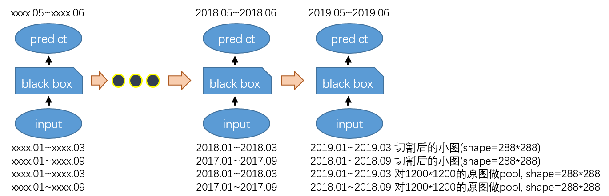
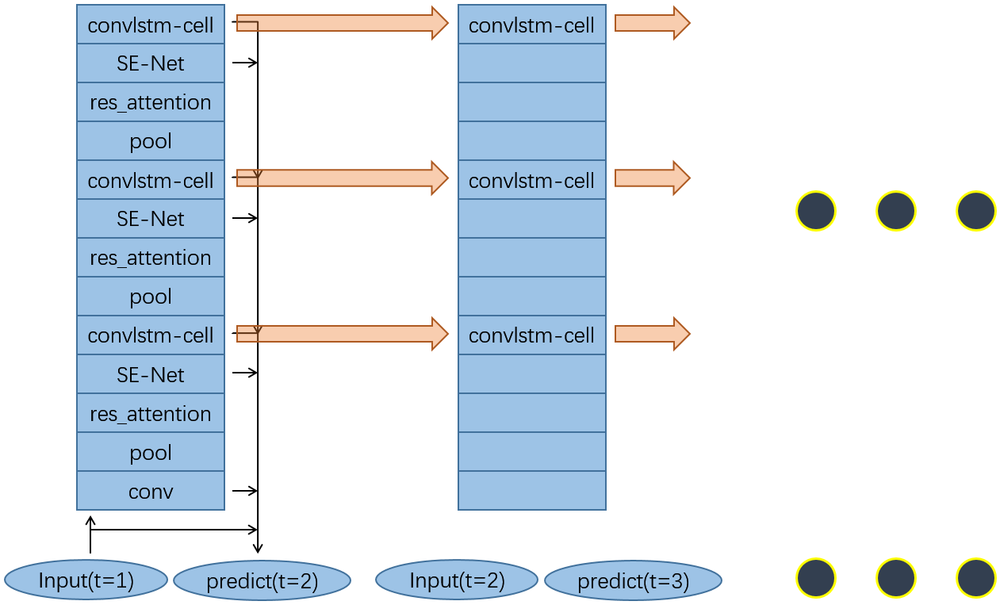
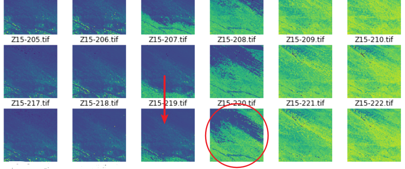
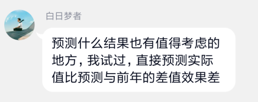
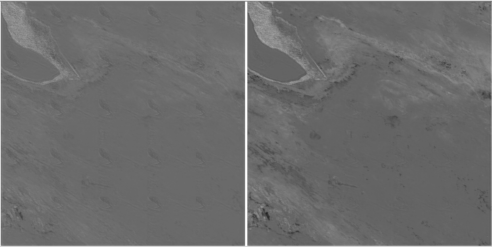

# 地球物候的深度学习预测

## 比赛官网： [地球物候的深度学习预测 www.dcjingsai.com](http://www.dcjingsai.com/common/cmpt/%E5%9C%B0%E7%90%83%E7%89%A9%E5%80%99%E7%9A%84%E6%B7%B1%E5%BA%A6%E5%AD%A6%E4%B9%A0%E9%A2%84%E6%B5%8B_%E7%AB%9E%E8%B5%9B%E4%BF%A1%E6%81%AF.html)


## 主办方简介：

佳格天地科技有限公司是一家农村场景下的大数据和人工智能创业公司。CEO张弓博士毕业于犹他州立大学，师从生态学泰斗Steve Running，曾在美国宇航局从事了8年研究工作。研发副总裁顾竹博士毕业于纽约州立大学，同样曾在美国宇航局工作。首席科学家宋宽博士毕业于马里兰大学，曾是美国大气海洋局VIIRS卫星发射科学团队成员，也曾是阿里云数据挖掘专家，担任6届天池算法大赛的出题/评委，1次CCF算法大赛评委，也是本次DC算法大赛的出题人。

> - **数据算法实习生 http://www.gagogroup.com/#employ**
> - 岗位职责；
> 1. 以好奇心和勇气去探索世界；
> 2. 用数据科学算法解决实际问题；
> - 任职要求：
> 1. 算法原理：在985/211/世界知名院校受过数据科学类的教育。在现代统计学、机器学习、深度学习、计算机视觉、信号处理、运筹学等领域中至少两个领域有较广泛的理解，并能在其中至少一个领域有深入理解学以致用；
> 2. 编程技能：Python+Tensorflow+OpenCV+SKLearn+Pandas+Numpy+Scipy是必须具备的能力；
> 3. 学习能力：对于Github和StackOverFlow有长期使用习惯，有阅读英文最新文献的习惯和能力；
> 4. 协作能力：能够和其他算法同学积极讨论，协作完成工作。能够和商务/售前同学协作，聚焦客户需求，努力争取项目；
> 5. 自律能力：能够合理分配自己的时间，同时进行1-3个项目的并行工作；懂得Deadline的重要性，督促项目相关合作各方。

## 数据：

数据文件为16位（int16）的Tiff文件，其中NDVI数据的标称值是(0，10000]，实际NDVI的数值是标称值的万分之一。每个Tiff文件的尺寸是1200x1200像素，每个像素代表地球上的1平方公里面积上的植被指数。每个数据文件夹包含地球上某个特定地区的数据时间序列，初赛共包含4个地区，在决赛中会继续增加地区的数量以及时间序列的长度。

## 官方提示：
一般来说，我们从卫星上看到的1公里分辨率的植被物候不仅仅是自然界植被，而还混杂了耕地、城市等等。也就是说，很可能从单个像素点来说，几个数值相同的点可能来自于完全不同的地物类型。因此，基于单像素的时间序列预测模型必然不是最佳的。我们人类在卫星图片的时间序列上是能够分辨出城市、乡村、常绿林、落叶林、草原、沙漠等等地表类型的，靠的是从大范围上的观察，而不仅是单个像素点。因此，我们期待选手们能够尝试把FCN和时序模型相结合，尤其是把感受野较大的FCN模型和周期性较强的时序模型相结合，构建自己的网络架构。祝大家好运！

各位天才少年们---我是本次大赛的出题人---本次大赛未设奖金，但是 —— 本次大赛进入前20名的队伍，只要你的算法有特色，有机会收获一份超乎想象的神秘彩蛋。一两年之后，也许你会发现这次大赛对你个人来说是迄今为止最值的一次大赛。为什么呢？先卖个关子。


## 解题过程：

### 0.运行说明

```bash
# python 3.6
# tenforslow 1.11.0
# 作者：bluove
# 首发于：https://github.com/bluove/__DL-prediction-on-earth-phenology
# 应该首先把数据都放在 ./data 文件夹下，分24个文件夹。
# 申明：本项目完全由本人独立完成，任何来自于其他人的idea,代码，论文，技术博客，qq群讨论，都在本readme里被引用（或者在源码注释里被引用）

git clone git@github.com:bluove/Deep-learning-prediction-on-earth-phenology.git

python preprocess.py

cd model_self_v2

python run.py
# 用笔记本移动版本的1060显卡，大概要跑80h。
# 如果要快速跑完流程（验证能不能跑），可以把./model_self_v2/HEADio.py里的参数EPOCH改为：
# EPOCH = int(1200/WIDTH)*int(1200/WIDTH)*0 + 2

cd ..

python postprocess.py

```

### 1.这应该算是彩蛋了吧
假如要预测Z1-213.tif，那么对往年同月份的数据，做一个**移动平均**，就可以，在初赛，拿到0.058461的分数。一开始进行数据可视化探索的时候就发现明显是按卫星月份拍照的，所以第一次提交是对往年同月份数据进行**简单平均**，得分0.07以上。**第二次提交用移动平均，得分0.058461，截图为证：**



这个真是一颗彩蛋啊，在QQ群公开后不知道咋的好像没多少人尝试。至少初赛，用下面的code绝对能刷到0.058000和0.058461之间。(决赛就不保证了...)

```python
ALPHA = 0.4
def guess(imglist):
    _output = read_as_array_func(imglist[0])
    for img in imglist:
        img = read_as_array_func(img)
        _output = _output*(1-ALPHA) + img*ALPHA
    return _output

predict_z1_213 = guess(['z1-009', 'z1-021', 'z1-033', ... ,'z1-201'])

```

不过这种方法，很难有进一步优化的空间，但是可以作为后续建模的重要参考。

先说一下移动平均的进步空间：对每一个地区每一个像素点设置一个ALPHA值，实现起来也非常简单，原函数不用修改，把ALPHA改成一个tensorflow变量就行。

再说移动平均对后续建模的帮助：移动平均，本质上是滤波，基于单像素点在时间维上的滤波。那么问题就清晰了，我们得到第一批关键词**滤波、降噪、平滑**。

### 2.主线剧情风格

:: **平滑、降噪** ::

### 3.import tensorflow as tf

#### 3.0简图





#### 3.1输入

根据主线剧情风格的精神，一切为"**平滑、降噪**"服务。上图中输出输入月份的选定就是这么来的。原始图片尺寸是1200\*1200，切割成240\*240。同时也考虑一点点overlap，实际喂进去的尺寸是288\*288，写loss的时候对288\*288的tensor与288\*288的tensor之间的差异进行度量，但是最终取出来的尺寸仍然是240\*240。

对原图切割可以理解，因为1200*1200对任何GPU来说都很困难吧。

而之所以把原图pool之后也作为输入，是因为需要模仿人类的感觉。你看：



假如要预测Z15-220，**作为一个人类**，看见Z15-207到Z15-219的变化，是不是就能猜到Z15-220绿色部分肯定会衰退很多？所以嘛，不是把尺寸喂1200\*1200的原始图片切割成5\*5=25份就行了的，**所以输入的时候附带上全局信息可能更好，因为这是作为人类的感觉**。嗯，overlap的原因也差不多一样。

**嗯，输入就是这么回事，输入尺寸是(H=288, W=288, C=24)**

另外，在比赛QQ群看见一条可能很好的idea，非常感谢"山威"队伍的"白日梦者"(QQ昵称)在QQ群的分享。



对这个idea我稍有改变，不是预测与前一年的差异，而是预测每一年与平均地貌的差异。原因是基于主线剧情风格的精神，我的理解是，这样做有两点好处：

1. 可以认为模型学习到的东西有两个，一个是地理大致形貌，一个是变化量。所以减去地理大致形貌之后，可能会减去模型负担，表现更好。

2. 对插值可视化可以看见细微变化，更好的定位错误原因。

#### 3.2输出

```python
pass
```

#### 3.3度量

```py
loss = 1/n*sum(distance(input(time=i+1), predict(time=i)), i=1,2,3...n)

# 一开始直接用取distance=mse，因为把1200\*1200的图片切割成小块之后，对于两个图片img1, img2
cache1 = rmse(img1_shape_1200_1200, img2_shape_1200_1200)
cache2 = 1/25*sum(rmse(img1_shape_240_240, img2_shape_240_240), i=1,2,...25)
# 但是：
cache1 !=cache2

# 而如果换成 mse, 不管切割成多少小块，整体的度量距离和切割成小块之后的度量距离是一致的。

# 再加上ref[]，一篇很类似的知乎文章里面说mse更好，于是选定mse了。

```

观察直接预测的结果，发现有很明显的这种情况：



**左侧是用mse度量**，直接预测得到的差异图；**右侧是用sqrt(sqrt(mse))度量**，以完全相同的初态、训练时间，直接预测得到的差异图。左侧在很多区域出现相同的模式，这不正常。嗯，再次强调，这是通过差异值可以看出来，但是如果直接预测原始图片，就发现不了这个现象啦！

推测是因为"长板效应"，对于每一个地区，有25个样本，每个样本的时间长度固定，模型的input_placeholder.shape=(BATCH=1, timesteps=timesteps, H=288, W=288, C=24)

这25个样本，有的样本(区域)很难预测，可能rmse高达0.2，有的样本(区域)很容易预测，可能rmse=0.001。这样下去，可能会被带偏，模型重点会尽力关注\/fit很难预测的区域，对其它区域则不怎么关心。比如模型在上图左上角部分"用力过猛"，而使得其它区域带有很明显的左上角特征。

如果对rmse再增加两次sqrt，那么本来两个样本直接的差距是0.2和0.01，现在它们的差距就是0.67和0.32了，这样，模型可能就会对rmse很高的区域和rmse很低的区域，均匀用力。实际上也是这样的，把mse改成sqrt(sqrt(mse(img1, img2)))之后，效果上图右侧。实际测试结果也表明对所有的地区，用sqrt(sqrt(mse))之后，loss值和val值的表现更好。

所以度量方式，就不用mse或rmse了，详见main.py源码。main.py的模型和简图有一点点不同，比如DenseNet结构等。

#### 3.4训练

如果只用一年，来做开发集(或称作验证集)，可能并能说明模型一定很好，所以用末尾连续两年的数据做val集，目的是找到合适的超参数。除了L2正则化的参数lamda，还有很多超参数，比如loss指数下降速度，loss写法，切割尺寸，overlap尺寸等。

确定超参数之后，再把所有数据都用于训练，输出题目要求的tif图片。

### 4.改进策略

1. 再训练更长一段时间。距离提交前三天还在修改模型结构，这点，其实未必有什么很大的帮助，可能直接几层conv几层fc就能有很好的效果如果配上好的训练策略的话。

2. 切割成240\*240小块之后，考虑更大的overlap。比如考虑小块之间重叠80个像素，也就是输入tensor尺寸是(240+80+80)\*(240+80+80)

3. 更宽的网络，更多的feature。现在网络的宽度是24，可能少了点。

4. 把普通conv换成OctConv，这个天然包含"频率"的观点。


### 5.源码阅读文档

```python
# -----------------------run.py----------------------------
# 这是生成tfrecords文件，减少IO对训练的影响。
python HEADio.py

# 先对所有地区训练一个粗糙的模型。
os.system(f"python ./main.py pre_train_for_all_zone {lamda}")

# 再对每一个地区训练一个模型
for _ in ['Z'+str(i) for i in range(1,25)]:
    os.system(f"python ./main.py {_} {lamda}")


# ----------------------HEADio.py---------------------------
负责IO部分，比如把原始数据转为tfrecords，负责利用训练好的网络给出输出文件。


# -----------------------main.py----------------------------
建模，构建loss，训练


# --------------------littletool.py-------------------------
定义一系列脚手架函数，如conv, pool, aspp, res_block ...


# -----------------------cell.py----------------------------
定义convlstm cell

```

## 总结

**失败。已经超过截至时间大约10个小时了，没跑够，有空，以后，再，提交，一次，然后就再也不管啦干别的去。。。**


## reference

> [0] Must Know Tips/Tricks in Deep Neural Networks (by Xiu-Shen Wei) http://lamda.nju.edu.cn/weixs/project/CNNTricks/CNNTricks.html

>[1] Convolutional LSTM Network: A Machine Learning Approach for Precipitation Nowcasting，http://arxiv.org/abs/1506.04214
>
>这篇2015.06.12的paper提出convlstm结构来预测降水。[作者知乎账号](https://www.zhihu.com/question/34318188)

>[2] Air Quality Forecasting Using Convolutional LSTM，https://cs230.stanford.edu/projects_spring_2018/reports/8291197.pdf
>
>这是吴恩达的2018年cs230春季课程的一个report，用convlstm来预测空气质量。

>[3] 彩云天气 https://zhuanlan.zhihu.com/p/56811476 
>
>彩云天气，用雷达回波图数据，外推未来一段时间的雷达回波图，从而做出分钟级天气预测。
>
>首先，分割的目的是要排除干扰，把飞机、飞鸟、中国尊以及一些不是降水的大气扰动找出来，判断雷达收到的回波究竟是不是降水回波。这个模型就是利用图像分割模型完成的。当时以 U-net 和 SegNet 为基础模型，标注了数据进行了训练。
>
>分割完成之后的预测部分也采用了全深度学习模型。我们训练了一个端到端的网络，把特定时间**分割过的雷达图**以及**一些其他数据**做输入，把未来一个时间点的分割过的雷达图做输出进行预测。例如雷电的预测就是输出一张和输入相同大小的矩阵，每个点上的值代表这个位置发生雷电的概率。

>[4] 卷积长短时记忆神经网络(ConvLSTM)雷达回波图像外推 https://zhuanlan.zhihu.com/p/40712680

>[5] https://github.com/gespinoza/hants

> https://github.com/carlthome/tensorflow-convlstm-cell

> lstm对周期性数据的效果 https://zhuanlan.zhihu.com/p/41933062

> seq2seq https://www.jiqizhixin.com/articles/041503

> 移动平均 https://zhuanlan.zhihu.com/p/38276041

> 清华大学李建：深度学习在时空大数据分析中的应用，2017-03-10 13:32http://www.tmtpost.com/2579314.html

> 很好的教程，kears实现lstm  http://resuly.me/2017/08/16/keras-rnn-tutorial/

> 十分钟看懂图像语义分割技术 https://www.leiphone.com/news/201705/YbRHBVIjhqVBP0X5.html

> 语义分割 | 发展综述 https://zhuanlan.zhihu.com/p/37618829

> 如何理解空洞卷积（dilated convolution）？ https://www.zhihu.com/question/54149221

> 佳格数据在2017.10.10~2017.12.11举办的[卫星影像的AI分类与识别](https://www.datafountain.cn/competitions/270/details)
> 语义分割类型，354支队伍，868名选手，50000元奖金池. 初赛最高分约90%，复赛最高分95%(此时90%只能排19) 初赛训练集是2张大的png格式图片，图片大小是7939\*7969，预测集是三张大的png格式图片，图片大小为5190\*5204，复赛训练集增加了3张大的png格式图片，复赛预测集也是三张png图片。初赛由于训练集较少，只有2张，预测集有3张，使用神经网络来进行预测效果普遍不好，准确率都在80%以下，参赛队伍中使用传统地物提取方法的队伍可以达到85%左右的准确率，长期稳坐第一的位置，到复赛的时候新增加了3张训练集，数据集增后，神经网络的效果就出来了，使用神经网络的队伍准确率都达到了90%以上，最高的能达到95%，可参考他的[gitub repository](https://github.com/Jiangfeng-Xiong/satellite_seg)，大神的准确率大概在95%左右。
> CCF 卫星遥感AI大赛，我们评选了354支队伍，最后把冠军颁给了两位大学生, 这篇[新闻报道](https://www.wenlc.com/weixin/20171228A0QA3U00.html)值得看几遍，有提到研究方法。那时还没有deeplabv3+，他们(华南理工计算机视觉研究生)用的是pspnet。然后三个月前，这个[github repository](https://github.com/anxiangSir/deeplabv3-Tensorflow)，用deeplabv3刷到超过95%的成绩。
> 大赛结束后，佳格天地的产品研发副总裁顾竹与 Fant 团队的贾晓义、熊江丰长谈了很久，肯定了他们的研究方式，希望他们可以在卫星影像 AI 分类与识别领域有更好的研究成果。

> tensorflow 实现convlstm https://blog.csdn.net/CV_YOU/article/details/81164393

> 深度学习网络调参技巧 https://zhuanlan.zhihu.com/p/24720954
> 贝叶斯调参不错 ~

> [目前主流的attention方法都有哪些？](https://www.zhihu.com/question/68482809)

> [几篇较新的计算机视觉Self-Attention](https://zhuanlan.zhihu.com/p/44031466)


https://zhuanlan.zhihu.com/p/50366974
http://www.crensed.ac.cn/portal/metadata/onlinelist
http://www.crensed.ac.cn/portal/metadata/629ade5d-f1d8-4b8a-8742-97c415483421

https://www.jianshu.com/p/3a308091353b

[Deep learning and process understanding for data-driven Earth system science](https://www.nature.com/articles/s41586-019-0912-1#auth-1)

[Deep learning in remote sensing: a review](https://arxiv.org/abs/1710.03959)

[遥感中的深度学习综述：社区的理论，工具和挑战（上）](http://www.doubixie.com/2018/04/12/rs-Survey/)

[遥感中的深度学习综述：社区的理论，工具和挑战（下）](http://www.doubixie.com/2018/04/23/1/)

[机器学习在地理学、地理信息、遥感、环境等学科中有何用途吗？](https://www.zhihu.com/question/42492917)

[Kaggle冠军告诉你，如何从卫星图像分割及识别比赛中胜出？](https://zhuanlan.zhihu.com/p/26663913)

[Kaggle优胜者详解：如何用深度学习实现卫星图像分割与识别](https://zhuanlan.zhihu.com/p/26377387)

[6次Kaggle计算机视觉类比赛赛后感](https://zhuanlan.zhihu.com/p/37663895)

[NASA NDVI](https://earthobservatory.nasa.gov/features/MeasuringVegetation/measuring_vegetation_2.php)

[论文笔记 Non-local Neural Networks](https://blog.csdn.net/elaine_bao/article/details/80821306)

[非局部神经网络（Non-local Neural Networks）](https://mp.weixin.qq.com/s/Fh2ob_qCNHeTOWHjZ9DRyg)

[github Non-Local_Nets-Tensorflow](https://github.com/nnUyi/Non-Local_Nets-Tensorflow)


---
## 解题草稿：

本次数据探索顺便用基于单像素的模型作出预测，简单的采用指数递减滑动平均值算法，目前(2019.02.14)排行top1，rmse=0.05846。由此可见这次比赛所有的选手都还未发力，也正常，才不到3周嘛。随机猜的话大约是0.45，所以baseline应该是rmse=0.05846，**要做到rmse=0.05才算合格, 如果能够做到rmse=0.02那就完美无缺了**。

奖励里面写着，**如果算法有特色而且通过面试，就有实习机会**。啊，这么多条件，好难啊。有特色嘛，可以集成，**基于单像素的滑动平均** + **12个相互交叉的小蓄水池** + **ConvLSTM**，这样总能算得上有特色吧！通过面试嘛，好难啊，各种难，数据结构，算法，python，cpp，leecode，项目，还要为公司特定职位准备专业算法的面试比如各种DRL

VGG-19 也不过 1.44 亿参数量（VGG-16 为 1.38 亿），而 1001 层的 ResNet 不过 0.102 亿的参数量。未来一周，就调调超参数，稍微改变网络结构。主要做一些无需脑力的活，如模块化，加上logger，管道可以等测试数据来了再决定要不要构建。

得准备面试了，至少应该找一份实习。不能捡芝麻丢西瓜，这个比赛只是、只是、只是面试资格而已。要面试资格的话，大部分公司我都能过简历关。。。

0. **必须至少刷到0.050以下才有把握决赛top1！！！否则可能沦落到第10左右。**

1. ~~继续训练，检查，是不是训练过程没到位~~

2. ~~为什么似乎zone一个比一个难训练，不应该啊，思考~~

   确实有这个趋势，是从提交结果排名看出来的，按难度，215>214>213, Z4>Z3>Z2>Z1。但是已经训练7000steps了，不管什么原因，在100epochs以上的情况下都可以忽略，不是训练时间不够的原因。

   submit20190312v1.zip, deeplearning Z2, best，好于ml的0.05846
   submit20190312v2.zip, deeplearning Z1Z2, middle，0.05\*2
   submit20190312v3.zip, deeplearning Z1, worst，0.06\*\*5

   推翻假设，地区不会造成系统性困难，时间有可能。在单项地区上，或者单项时间上，deeplearning有可能超越ml，所以总体上超越ml也是有可能的，是应该的。关键还是在网络结构上。另外，线下的loss都普遍降到0.053，为何线上测试的时候飙升至0.06，是个问题。可能需要对lamda调整，或者添加L1正则化如何。但L1的先验分布exp(-abs(x))和图片似乎不符合。

3. ~~help_loss应该把原图做pool之后再加0.1的权重来比对的~~
4. ~~如何魔改loss，魔改。~~
   ~~应该看一些论文，看看别人是怎么改的。~~
   ~~a. sum(abs(perdict-target))/sum(target)~~
   ~~b. rmse->mse~~

5. ~~去除现有网络架构的冗余，优化，增强model容量~~
6. ~~所有情况构建一个统一的管道，实际用的时候可以按需随机抽取~~
7. ~~如何集成 moving-avg。
   以alpha_matrix来做，然后根据alpha_matrix来加权融合，alpha大的点代表较为固定的点，设ml权重0.7，反之设置dl权重0.7~~
8. ~~moving-avg deeplearning 化，找到ml的极限~~
9. ~~可以把预测的3张图片堆叠在一起做rmse，这和分别做rmse有差别，已验证在200*200的情况最多有0.007的误差，但都是单向误差，堆叠在一起的rmse比分开来算要大。不知道是好事还是坏事，但是这里不需要修改，应该把时间花在别的方面。~~
10. 代码风格优化。这个很麻烦的，不仅是模块化的问题，还有变量命名，函数抽象方式组织方式等等，可以等最后再做
11. 多尺度输入，不必预处理，直接在现有模型前加pool即可。
12. ~~attention in cv~~
    啊，一下子，DenseNet，SENet，attention，全搞进去了。


~~max pooling比avg pooling效果会好一些。~~

NDVI数据有噪音，利用HANTS对NDVI数据处理，得到重建后的NDVI数据。

~~观察一下tf.sigmoid()的输出有没饱和。~~

~~初始化，当然是kaiming_normal或者xavier_normal。~~

~~檢查一下iterator的随机性~~


> 在QQ群分享思路，线上分数在0.05800和0.05840之间，总运行时间<60s：
```python
ALPHA = 0.4
def guess(imglist):
    _output = read_as_array_func(imglist[0])
    for img in imglist:
        img = read_as_array_func(img)
        _output = _output*(1-ALPHA) + img*ALPHA
    return _output

# each predict img need 1s
predict_z1_213 = guess(['z1-009', 'z1-021', 'z1-033', ... ,'z1-201'])

DL模型以convlstm为框架，纵向上加上cv里的attention模块，也参考了一点DenseNet，然后模仿deeplab-v3+结构预测输出。直接预测原始图片，DL模型train可以降低到0.048，但是val很大(0.061)，线上表现也不好。

我觉得预测图片的差值，而不是原始图片这个idea非常好，虽然还没验证。
```


https://imlogm.github.io/%E6%B7%B1%E5%BA%A6%E5%AD%A6%E4%B9%A0/vgg-complexity/
> 我第一次读到ResNet时，完全不敢相信152层的残差网络，竟然在时间复杂度（计算量）上和16层的VGG是一样大的。
>
> https://imlogm.github.io/%E6%B7%B1%E5%BA%A6%E5%AD%A6%E4%B9%A0/inception/
>
> http://hellodfan.com/2018/03/07/%E8%AF%AD%E4%B9%89%E5%88%86%E5%89%B2%E8%AE%BA%E6%96%87-Dilated-Residual-Networks/


>[算法工程师如何突破模型调研瓶颈期？](https://zhuanlan.zhihu.com/p/58817004)
>
>1. 误差分析，查case。很多算法岗位同学执着于探索如何使用更复杂的模型，而对看case经常不屑一顾。这是一个典型的误区，调研工作不仅要仰望星空，而且要脚踏实地。在公司里安身立命的**根本是提高业务效果，并不拘泥于任何可行的解决方案**。针对如何发挥看case的作用，具体来说，可将模型预测错误的case输出出来，仔细分析其错误原因，并分门别类，**然后针对每类的问题分析其解决方法**，到底是加特征还是修改模型结构？这种方式对效果提升可有一定预期的，比如一类预测错误的case大约占比0.1%，那么修复后准确率提升的天花板就是0.1%，当然也有引入新bad case的可能。
>2. 勤于思考。很多同学喜欢快糙猛把所有想到的模型或者网络结构都尝试一番，效果不好就又再试其它新的方法，反反复复，最终无法获得明显的业务收益。个人建议在每个尝试点结束之后要多思考。针对有效的尝试，要看是否已经将其效果发挥到了极致？其实没有效果的尝试也是有意义的，起码能说明一个潜在的方案并没有效果。针对无效的尝试，**要思考为什么没有效果**，没有效果背后一般都是有一定原因的，如果搞不清楚，那尝试的意义就会大打折扣了。反之如果搞清楚了对后续的模型迭代工作有一定的指导意义。勤思考的结果就是对业务特点会越来越清楚，激发的idea也会越来越多，效果提升的可能也越大。
> 3. 看文献。这里的文献就是包括论文、技术博客、微信公众号等一切可以获取idea的资源。论文主要包括经典论文或者工业界发的一些论文。和图像领域等不同，像推荐等业务由于实际业务强驱动和海量的数据资源，工业界的研究肯定要优于学术界。新出来的论文总是眼花缭乱推陈出新，其中能被工业界采纳并成为标配的论文少之又少。对于如何将论文里的模型应用到真实场景，我倾向于借鉴论文里可能有用的部分思路，相当于**给已有模型做加法，而不是而不是**把论文的模型整体搬过来，然后发现效果不行再去做减法。因为问题场景和数据特点存在差异，一般很难直接搬过来就有明显效果，这一点即使很多偏高阶的同学也容易犯错。
> 4. 快速迭代。迭代速度是制约模型调研的一个核心因素，足够的机器资源并充分利用可大大加快模型调研的节奏。**这一点的重要性可比肩前面所有条加起来**。一个人在业务指标上的贡献大致可看做正比于探索过的idea数目。在总时间一定的情况下，单个实验的成本越低，自然可做更多的实验。我司提供的GPU资源还是非常充足的，开始的时候我们探索过单机多卡训练，很可惜当时收敛效果并不理想就放弃了。


交流：
1. 我是按官方提示的框架来，用 lstm+FCN，具体是把 deeplabv3 的 base network 中间某些层变成 lstm cell。
你们大概的模型是啥样的啊？
2. 目前我的总参数量约1.2e6，同一个模型，为每个地区训练分别一次
你们觉得，有必要为每个地区单独训练一个模型吗，你们的总参数量是多少啊？
3. 你们觉得如果佳格的算法工程师来做，能把这比赛刷到多少分啊，也就是说你们觉得这题的极限分数大约是多少啊？

